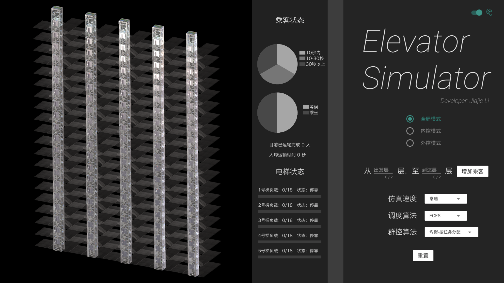
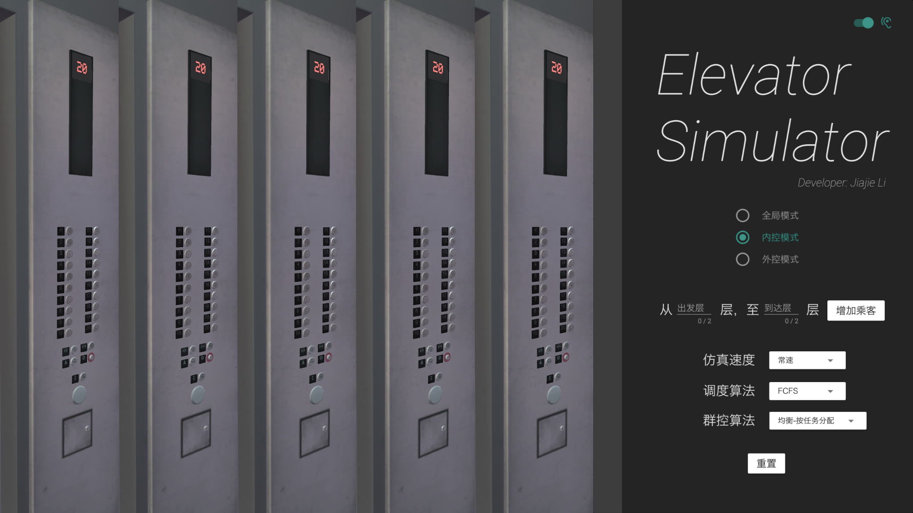
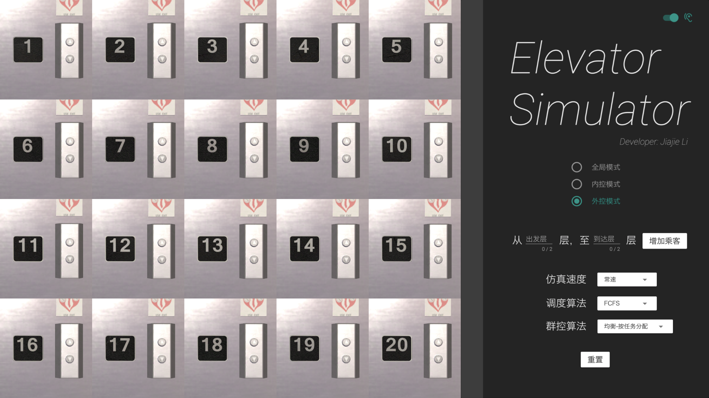

# Elevator_Simulator_WebGL
An elevator scheduling simulator, developed using Unity3D.
The WebGL version can be accessed here (full screen is recommended):https://leejaja.github.io/Elevator_Simulator_WebGL

## Preview

